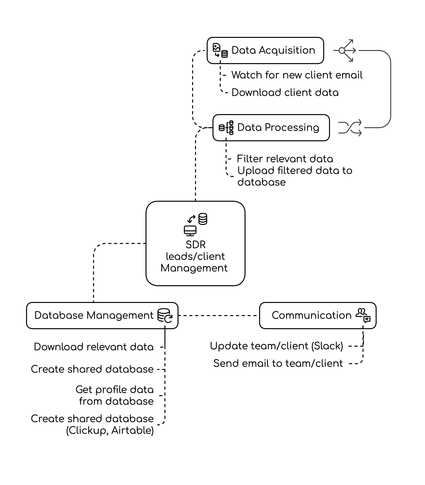
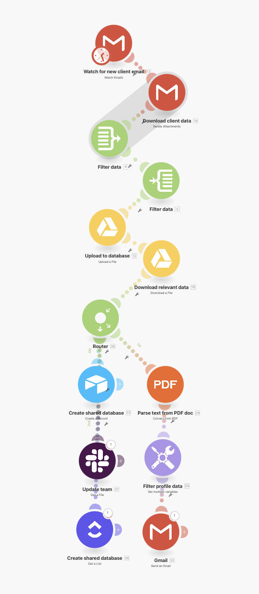

---
params:
  title: "Automated SDR (client onboarding)"     
  subtitle: "Gmail, Google Drive, Clickup, Airtable, Slack"    
  author: "99fold"
  email: "matt@99foldai.com"
  social: "@99foldai"
  date: "April 2025"    
  primary: "#284e36"
  secondary: "#c3c3c3"
  header1: "Summary"
  header2: "Integrations"
  header3: "Workflow"
  header4: "Outcomes"
  header5: "Example"
  here: "r"
  imgdir: "img"
  app1: "gmail.png"
  app2: "gdrive.png"
  app3: "gplus.png"
  app4: "slack.png"
  app5: "airtable.png"
  app6: "clickup.png"
  img1: "make_clickup.png"
  img2: "clickup_ui.png"
  img3: "slack_ui.png"
  img4: ""
  img5: ""
  img6: ""
  github: ""      
output: 
  # pdf_document:
  html_document:
    theme: "cosmo"
    css: css/style.css
    includes:
      # reactivate once header img sizing is fixed  
      before_body: html/header.html
      after_body: html/footer.html
---

<!-- quicksand font -->

<!-- <link rel="stylesheet"href="//fonts.googleapis.com/css?family=Quicksand:300,400,600,700&amp;lang=en"/> -->

<!-- css for tabs -->


<!-- Calendly badge widget begin -->
<link href="https://assets.calendly.com/assets/external/widget.css" rel="stylesheet">
<script src="https://assets.calendly.com/assets/external/widget.js" type="text/javascript" async></script>
<script type="text/javascript">window.onload = function() { Calendly.initBadgeWidget({ url: 'https://calendly.com/99foldai/intro-chat?primary_color=284e36', text: 'Like this automation? Jump on a call to see more.', color: '#284e36', textColor: '#ffffff' }); }</script>
<!-- Calendly badge widget end -->


```{=html}
<style type="text/css">

.nav>li>a{
    position: relative;
    display: block;
    padding: 10px 15px;
}

.nav-pills>li>a:hover{
  background: `r params$primary`;
  color: `r params$secondary`;
  opacity:0.7;
}

.nav-pills>li>a:focus, .nav-pills>li.active>a, .nav-pills>li.active>a:hover, .nav-pills>li.active>a:focus {
  background: `r params$primary`;
  background-color: `r params$primary`;
}

</style>
```


```{r, set-options, echo = F, cache = T, message=F}
options(width=25,tinytex.verbose = TRUE, width.cutoff=25)
knitr::opts_chunk$set(
 eval = F, # run all code
 echo = F, # show code chunks in output 
 tidy = T, # make output as tidy
 message = F,  # mask all messages
 warning = F, # mask all warnings 
 size="small", # set code chunk size,
 tidy.opts=list(width.cutoff=25) # set width of code chunks in output
)
# tinytex::install_tinytex()
# require(tinytex)
# install.packages("pacman")
# require(pacman)

# knitr::read_chunk(here::here("r","make_map.R"))
# source(here::here("r","make_gitignore.R"))
# source(here::here("r","make_plot_stacked.R"))
```

\  
\  

# [`r params$title`]{style="font-size: 200%;"}
# [`r params$subtitle`]{style="font-size: 150%;"}

\  
\      

<center> 
[`r params$author` | `r params$email` | `r params$social`]{style="font-size: 120%; color:`r params$secondary`;"} 

<!-- feather icons -->
<script src="https://unpkg.com/feather-icons"></script>

<p>
    
    <!-- calendly -->
    <a href="https://urldefense.com/v3/__https://www.linkedin.com/in/mmalishev/__;!!LBk0ZmAmG_H4m2o!oVrnGVTq4VaGa7cN1gDQyR-O-uL_Yd8JSrkae11vsa2I21g1vV9KxKx0txpwzaf2r62aEVKCC1cHORxRiSg$"> <!-- calendly -->
        <i data-feather="mail"></i> 
    </a>
    <!-- linkedin -->
    <a href="https://urldefense.com/v3/__https://www.linkedin.com/in/mmalishev/__;!!LBk0ZmAmG_H4m2o!oVrnGVTq4VaGa7cN1gDQyR-O-uL_Yd8JSrkae11vsa2I21g1vV9KxKx0txpwzaf2r62aEVKCC1cHORxRiSg$"> <!-- linkedin -->
        <i data-feather="linkedin"></i> 
    </a>
    <a href="">  <!-- instagram -->
        <i data-feather="instagram"></i> 
    </a>
</p>

<!-- feather icons -->
<script>
feather.replace()
</script>

&nbsp;


</center>

\  

---

\  

<!-- #### Refs   -->
<!-- Apify: https://console.apify.com/actors/oAuCIx3ItNrs2okjQ/runs/5I1jMq1JPXb79H4AU#output           -->
<!-- Napkin url: https://app.napkin.ai/page/CgoiCHByb2Qtb25lEiwKBFBhZ2UaJDRlMWI1MGIyLTk0MzAtNDVlMS1iYzMyLTFkYTY5ZGRhZDM5Mg?s=1   -->


<!-- ------------------------------------------------------------------------ -->

<!-- # `r params$header1` {.tabset .tabset-fade .tabset-pills} -->
<!-- tab1 -->
<!-- ## [Plots]{style="color:`r params$secondary`;"} # add custom css styling to tabs-->

# `r params$header1`

Detailed and systemised automated workflow for Sales Development Representatives (SDR) and leads/client onboarding and nurturing, starting from client onboarding, auto processing and filtering new client data, creating shared team/client databases, and initiating new intra- and inter- personal comms for relevant team members and client.    

1. Watch for new client email  
Monitor inbox for incoming emails from new or existing clients. 

2. Download client data  
Retrieve attached documents or files from the client's email.  

3. Filter relevant data  
Apply conditions to isolate only the necessary or actionable data.  

4. Upload filtered data to database  
Send cleaned and structured data to the appropriate database.  

5. Download relevant data  
Pull additional or related information needed for the process from a data source.  

6. Create shared database and new record  
Initialize a shared workspace and log a new entry with client data.  

7. Update team with parsed info  
Notify internal team members with the extracted and organized client information.  

8. Create shared database (Airtable, Clickup)  
Generate an Airtable/Clickup workspace for collaborative client or project data.  

9. Update team/client (Slack)  
Send automated status or data updates to team or client via Slack.  

10. Send email to team/client  
Email final results, updates, or next steps to team and client email channels      


\  

---

\  

# `r params$header2`  

\  
Low-friction integration with your existing apps, workflow, and systems      

<!-- ##### Side by side image -->  

```{r, echo = FALSE, out.width = "15%", fig.align = "center", fig.show='hold', fig.align='center', out.extra = "style='display:inline-block; margin-right:5px;'"}
knitr::include_graphics(c(
  paste(params$imgdir,params$app1,sep = "/")
  ,paste(params$imgdir,params$app2,sep = "/")
  ,paste(params$imgdir,params$app3,sep = "/")
  ,paste(params$imgdir,params$app4,sep = "/")
  ,paste(params$imgdir,params$app5,sep = "/")
  ,paste(params$imgdir,params$app6,sep = "/")
  ))
```

\    

---

\  

# `r params$header3`
\  

<!-- left justified image -->
<div class = "row">
  <div class = "col-md-8"> <!-- img  -->
  <center> 
  </center>
</div>
  <div class = "col-md-4"> 
  <br>

> Step-by-step integration with existing client database apps   

  </div>
</div>

\    

<!-- right justified image -->
<div class = "row">
  <div class = "col-md-4 right-just"> <!-- img  -->
  <br><br>     

> Seamlessly create a new team/client shared database that auto populates  

<br>     
</div>
  <div class = "col-md-8"> 
  <center> 
  </center>
  </div>
</div>

\  

<!-- left justified image -->
<div class = "row">
  <div class = "col-md-8"> <!-- img  -->
  <center> 
  </center>
</div>
  <div class = "col-md-4"> 
  <br>  

> Automate the entire intra- and inter- communication pipeline (Slack, Clickup, Trello, Google)  

  </div>
</div>

\  

---

\    

# `r params$header4`

### Tasks  
- Automate the process of client management and nurturing        
- Enhance team collaboration through shared databases      
- Streamline communication with clients and team members        

### Benefits  
- Efficient data management leads to quicker client onboarding and project delivery, ultimately boosting sales  
- Timely updates and accurate data handling enhance client satisfaction and trust 
- Streamlined workflows reduce manual errors and save time, allowing teams to focus on strategic initiatives    

\  

---

\    


# `r params$header5`

Example of automated workflow (replace with your own tasks/apps)        


<center>
    
</center>

\  

<center>
    
</center>


#


