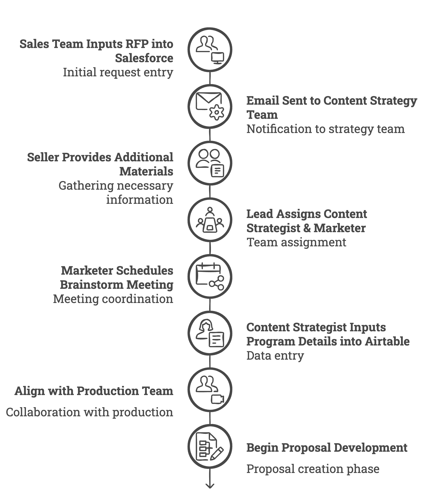
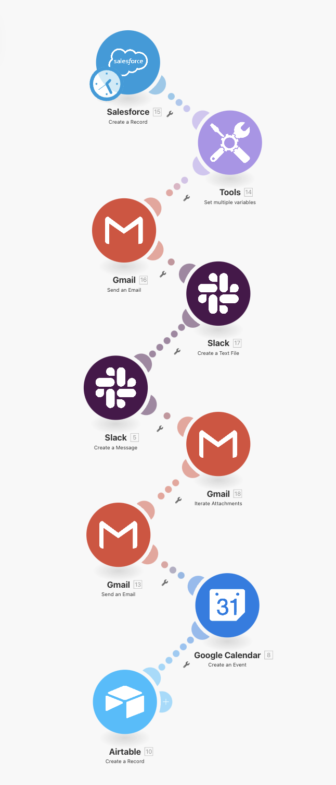

---
params:
  title: "Content strategist (client and RFP pipeline)"       
  subtitle: "Salesforce, Gmail, Airtable, Slack"        
  author: "99fold"
  email: "matt@99foldai.com"
  social: "@99foldai"
  date: "April 2025"    
  primary: "#284e36"
  secondary: "#c3c3c3"
  header1: "Summary"
  header1b: "Who is this perfect for?"
  header1c: "What does it do for you?"  
  header1d: "How does it work?"  
  header2: "Pathway"
  header3: "Process"
  header4: "More benefits"
  header5: "Example"
  here: "r"
  imgdir: "img"
  app1: "app1.png"
  app2: "app2.png"
  app3: "app3.png"
  app4: "app4.png"
  img1: "img1.png"
  img2: "img2.png"
  img3: "img3.png"
  img4: ""
  img5: ""
  img6: ""
  roihours: 15
  roivalue: 3000
  roirate: 7
  github: ""      
output: 
  # pdf_document:
  html_document:
    self_contained: false
    theme: "cosmo"
    css: css/style.css
    includes:
      # reactivate once header img sizing is fixed  
      before_body: html/header.html
      after_body: html/footer.html
---

<!-- quicksand font -->

<!-- <link rel="stylesheet"href="//fonts.googleapis.com/css?family=Quicksand:300,400,600,700&amp;lang=en"/> -->

<!-- css for tabs -->


```{r, echo=F, eval=T, error=F, warning=F, results='asis'}

htmltools::HTML(readr::read_file(here::here("html", "calendly.html")))
```


```{=html}
<style type="text/css">

.nav>li>a{
    position: relative;
    display: block;
    padding: 10px 15px;
}

.nav-pills>li>a:hover{
  border-radius: 15px;
  background: `r params$primary`;
  color: `r params$secondary`;
  opacity:0.7;
}

.nav-pills>li>a:focus, .nav-pills>li.active>a, .nav-pills>li.active>a:hover, .nav-pills>li.active>a:focus {
  border-radius: 15px;
  background: `r params$primary`;
  background-color: `r params$primary`;
}


</style>
```


```{r, set-options, echo = F, cache = T, message=F}
options(width=25,tinytex.verbose = TRUE, width.cutoff=25)
knitr::opts_chunk$set(
 eval = F, # run all code
 echo = F, # show code chunks in output 
 tidy = T, # make output as tidy
 message = F,  # mask all messages
 warning = F, # mask all warnings 
 size="small", # set code chunk size,
 tidy.opts=list(width.cutoff=25) # set width of code chunks in output
)
# tinytex::install_tinytex()
# require(tinytex)
# install.packages("pacman")
# require(pacman)

# knitr::read_chunk(here::here("r","make_map.R"))
# source(here::here("r","make_gitignore.R"))
# source(here::here("r","make_plot_stacked.R"))
```

\  

# [`r params$title`]{style="font-size: 200%;"}
# [`r params$subtitle`]{style="font-size: 100%;"}

\   


<center> 
[`r params$author` | `r params$email` | `r params$social`]{style="font-size: 120%; color:`r params$secondary`;"} 

<!-- feather icons -->
<script src="https://unpkg.com/feather-icons"></script>

<p>
    
    <!-- email -->
    <a href="https://urldefense.com/v3/__https://www.linkedin.com/in/mmalishev/__;!!LBk0ZmAmG_H4m2o!oVrnGVTq4VaGa7cN1gDQyR-O-uL_Yd8JSrkae11vsa2I21g1vV9KxKx0txpwzaf2r62aEVKCC1cHORxRiSg$"> <!-- calendly -->
        <i data-feather="mail"></i> 
    </a>
    <!-- linkedin -->
    <a href="https://urldefense.com/v3/__https://www.linkedin.com/in/mmalishev/__;!!LBk0ZmAmG_H4m2o!oVrnGVTq4VaGa7cN1gDQyR-O-uL_Yd8JSrkae11vsa2I21g1vV9KxKx0txpwzaf2r62aEVKCC1cHORxRiSg$"> <!-- linkedin -->
        <i data-feather="linkedin"></i> 
    </a>
    <a href="">  <!-- instagram -->
        <i data-feather="instagram"></i> 
    </a>
</p>

<!-- feather icons -->
<script>
feather.replace()
</script>

&nbsp;


</center>

\  

---

\  

<!-- #### Refs   -->
<!-- Apify: https://console.apify.com/actors/oAuCIx3ItNrs2okjQ/runs/5I1jMq1JPXb79H4AU#output           -->
<!-- Napkin url: https://app.napkin.ai/page/CgoiCHByb2Qtb25lEiwKBFBhZ2UaJDRlMWI1MGIyLTk0MzAtNDVlMS1iYzMyLTFkYTY5ZGRhZDM5Mg?s=1   -->


<!-- ------------------------------------------------------------------------ -->

<!-- # `r params$header1` {.tabset .tabset-fade .tabset-pills} -->
<!-- tab1 -->
<!-- ## [Plots]{style="color:`r params$secondary`;"} # add custom css styling to tabs-->

# `r params$header1`

This automated workflow is designed for a Content Strategist overseeing content strategy proposals. It guides the process from initial RFP intake to final proposal delivery, integrating tools like Salesforce for tracking, Gmail and Slack for communication, and Google Calendar for scheduling key milestones. The automation ensures real time tracking for team/client to ensure accountability and alignment across creative, strategy, and sales teams. Streamlines collaboration, reduce manual follow-ups, and maintain visibility into proposal progress. 

# `r params$header1b`  

#  {.tabset .tabset-fade }

## Digital media company \ 
## Print publisher \   
## Media strategist \  
## Marketing agency \ 
## Creative agency \ 
## Service provider  \
## Brand strategist \ 
## Creative/art director \  
## Design studio \  

# `r params$header1c`


```{r, echo=F, eval=T, error=F, warning=F,results=F}
source(here::here("r","roi.R"))
```

```{=html}
<div class="widget-container"><div class="section-heading">Time and tasks</div><div class="flex-row"><div class="data-box"><div class="data-label">Task hours (p/w)</div><div class="data-value"> `r task_hours_pw` </div></div><div class="data-box"><div class="data-label">Average client value ($)</div><div class="data-value">`r paste0("$",client_value)`</div></div><div class="data-box"><div class="data-label">Average close rate (%)</div><div class="data-value">`r params$roirate`</div></div></div><div class="section-heading">Outcomes</div><div class="flex-row"><div class="data-box"><div class="data-label">Hours saved (p/m)</div><div class="data-value">`r hours_saved_pm `</div></div><div class="data-box"><div class="data-label">Annual topline ROI ($)</div><div class="data-value">`r annual_roi`</div></div></div></div>
```


\  

```{r, echo=F, eval=T, error=F, warning=F, results='asis'}

htmltools::HTML(readr::read_file(here::here("html", "calendly_inline.html")))
```
 
\  


# `r params$header1d`  

1. The sales team inputs the RFP request into Salesforce, which is then sent via email to the wider Content Strategy team.     

2. The seller follows up by providing additional materials such as PDFs and meeting context to help us understand the ask in the email chain     

3. Based on the budget and creative scope, my lead tags me on the email as the assigned Content Strategist + a Marketer is assigned.     

4. A brainstorm meeting is scheduled via Google Calendar by the Marketer, with all materials included in the calendar invite    

5. After the sales brainstorm, input the program details into Airtable and connect with the production team to align on the direction of the program and begin generating the proposal.     

 

\ 

---

\  

# `r params$header2`  

\  
Low-friction integration with your existing apps, workflow, and systems      

<!-- ##### Side by side image -->  

```{r, echo = FALSE, out.width = "15%", fig.align = "center", fig.show='hold', fig.align='center', out.extra = "style='display:inline-block; margin-right:5px;'"}
knitr::include_graphics(c(
  paste(params$imgdir,params$app1,sep = "/")
  ,paste(params$imgdir,params$app2,sep = "/")
  ,paste(params$imgdir,params$app3,sep = "/")
  ,paste(params$imgdir,params$app4,sep = "/")
  ))
```

\  

---

\  

# `r params$header3`
\  

<!-- left justified image -->
<div class = "row">
  <div class = "col-md-8"> <!-- img  -->
  <center> 
  </center>
</div>
  <div class = "col-md-4"> 
  <br>

> Create a new RFP request and loop in team and client (Salesforce) 

  </div>
</div>

\    

<!-- right justified image -->
<div class = "row">
  <div class = "col-md-4 right-just"> <!-- img  -->
  <br><br>     

>  Notify team and client through comms portal with automated real-time project updates (Slack)  

<br>     
</div>
  <div class = "col-md-8"> 
  <center> 
  </center>
  </div>
</div>

\  

<!-- left justified image -->
<div class = "row">
  <div class = "col-md-8"> <!-- img  -->
  <center> 
  </center>
</div>
  <div class = "col-md-4"> 
  <br>  

> Trigger automated data entry to database (Airtable, Google Drive, Clickup) and connect with the production team to align on proposal direction        

  </div>
</div>

\  


---


\  

```{r, echo=F, eval=T, error=F, warning=F, results='asis'}

htmltools::HTML(readr::read_file(here::here("html", "calendly_inline.html")))
```
 
\  
  

# `r params$header4`

### Tasks
- Automate RFP intake and assignment with multiple teams and clients    
- Streamlines collaboration, reduce manual follow-ups, and maintain visibility into proposal progress   
- Accelerate proposal creation and reporting through automated triggers integrated with client data portal      

### Benefits
- Faster proposal turnaround leads to more closed deals     
- Streamlined workflow reduces wasted time and effort    
- Clear communication and alignment across teams    

\  

---

\    


# `r params$header5`

Example of automated workflow (replace with your own tasks/apps)        


<center>
    
</center>

\  

<center>
    
</center>


#


\  

```{r, echo=F, eval=T, error=F, warning=F, results='asis'}

htmltools::HTML(readr::read_file(here::here("html", "calendly_inline.html")))
```
 
\  


