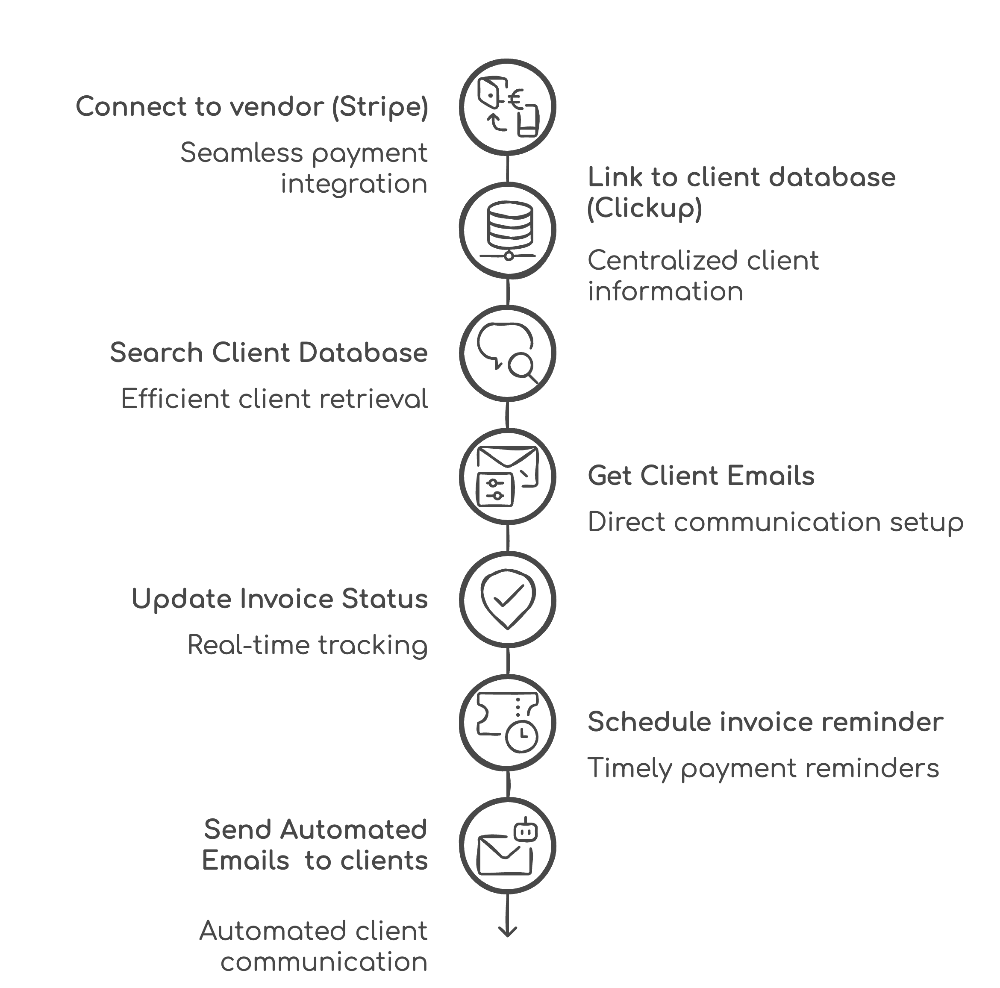
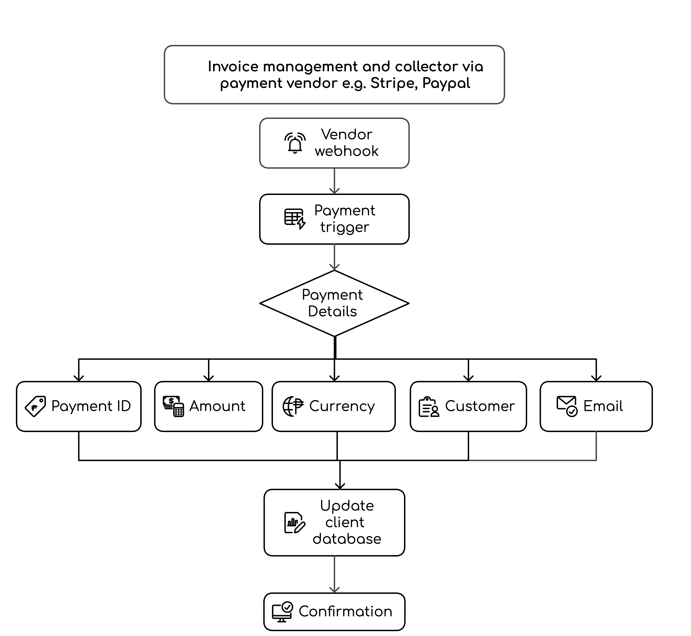

---
params:
  title: "Automated invoicing system"     
  subtitle: "Stripe, PayPal, Clickup, Gmail"    
  author: "99fold"
  email: "matt@99foldai.com"
  social: "@99foldai"
  date: "April 2025"    
  primary: "#284e36"
  secondary: "#c3c3c3"
  header1: "Summary"
  header1b: "Who is this perfect for?"
  header1c: "What does it do for you?"  
  header1d: "How does it work?"  
  header2: "Pathway"
  header3: "Process"
  header4: "More benefits"
  header5: "Example"
  here: "r"
  imgdir: "img"
  app1: "stripe.png"
  app2: "paypal.png"
  app3: "gdrive.png"
  app4: "gmail.png"
  img1: "stripeui.png"
  img2: "clickup.png"
  img3: "emailevent.png"
  img4: ""
  img5: ""
  img6: ""
  github: ""      
output: 
  # pdf_document:
  html_document:
    theme: "cosmo"
    css: css/style.css
    includes:
      # reactivate once header img sizing is fixed  
      before_body: html/header.html
      after_body: html/footer.html
---

<!-- quicksand font -->

<!-- <link rel="stylesheet"href="//fonts.googleapis.com/css?family=Quicksand:300,400,600,700&amp;lang=en"/> -->

<!-- css for tabs -->


```{r, echo=F, eval=T, error=F, warning=F, results='asis'}

htmltools::HTML(readr::read_file(here::here("html", "calendly.html")))
```


```{=html}
<style type="text/css">

.nav>li>a{
    position: relative;
    display: block;
    padding: 10px 15px;
}

.nav-pills>li>a:hover{
  background: `r params$primary`;
  color: `r params$secondary`;
  opacity:0.7;
}

.nav-pills>li>a:focus, .nav-pills>li.active>a, .nav-pills>li.active>a:hover, .nav-pills>li.active>a:focus {
  background: `r params$primary`;
  background-color: `r params$primary`;
}

</style>
```


```{r, set-options, echo = F, cache = T, message=F}
options(width=25,tinytex.verbose = TRUE, width.cutoff=25)
knitr::opts_chunk$set(
 eval = F, # run all code
 echo = F, # show code chunks in output 
 tidy = T, # make output as tidy
 message = F,  # mask all messages
 warning = F, # mask all warnings 
 size="small", # set code chunk size,
 tidy.opts=list(width.cutoff=25) # set width of code chunks in output
)
# tinytex::install_tinytex()
# require(tinytex)
# install.packages("pacman")
# require(pacman)

# knitr::read_chunk(here::here("r","make_map.R"))
# source(here::here("r","make_gitignore.R"))
# source(here::here("r","make_plot_stacked.R"))
```

\  

# [`r params$title`]{style="font-size: 200%;"}
# [`r params$subtitle`]{style="font-size: 100%;"}

\       

<center> 
[`r params$author` | `r params$email` | `r params$social`]{style="font-size: 120%; color:`r params$secondary`;"} 

<!-- feather icons -->
<script src="https://unpkg.com/feather-icons"></script>

<p>
    
    <!-- calendly -->
    <a href="https://urldefense.com/v3/__https://www.linkedin.com/in/mmalishev/__;!!LBk0ZmAmG_H4m2o!oVrnGVTq4VaGa7cN1gDQyR-O-uL_Yd8JSrkae11vsa2I21g1vV9KxKx0txpwzaf2r62aEVKCC1cHORxRiSg$"> <!-- calendly -->
        <i data-feather="mail"></i> 
    </a>
    <!-- linkedin -->
    <a href="https://urldefense.com/v3/__https://www.linkedin.com/in/mmalishev/__;!!LBk0ZmAmG_H4m2o!oVrnGVTq4VaGa7cN1gDQyR-O-uL_Yd8JSrkae11vsa2I21g1vV9KxKx0txpwzaf2r62aEVKCC1cHORxRiSg$"> <!-- linkedin -->
        <i data-feather="linkedin"></i> 
    </a>
    <a href="">  <!-- instagram -->
        <i data-feather="instagram"></i> 
    </a>
</p>

<!-- feather icons -->
<script>
feather.replace()
</script>

&nbsp;


</center>

\  

---

\  

<!-- #### Refs   -->
<!-- Apify: https://console.apify.com/actors/oAuCIx3ItNrs2okjQ/runs/5I1jMq1JPXb79H4AU#output           -->
<!-- Napkin url: https://app.napkin.ai/page/CgoiCHByb2Qtb25lEiwKBFBhZ2UaJDRlMWI1MGIyLTk0MzAtNDVlMS1iYzMyLTFkYTY5ZGRhZDM5Mg?s=1   -->


<!-- ------------------------------------------------------------------------ -->

<!-- # `r params$header1` {.tabset .tabset-fade .tabset-pills} -->
<!-- tab1 -->
<!-- ## [Plots]{style="color:`r params$secondary`;"} # add custom css styling to tabs-->

# `r params$header1`

Automated database and email scheduling system for efficient invoicing and client management by linking your vendor portal with your client database and communication channels.       


\  

---

\  


# `r params$header1b`  

#  {.tabset .tabset-fade }

## Service provider  \
## Sales teams \ 
## Recruitment agency \  
## Brick and mortar business \  
## Sport clubs \  
## Tourism agency \  
## Digital design business \  
## Service provider  \
## Brand strategist \ 


# `r params$header1d` 

1. Connect to Vendor (e.g., Stripe, PayPal)    
Establish a connection with the payment vendor to facilitate transactions.  

2. Link to Client Database (e.g., Clickup, Google Sheets)      
Integrate the vendor with the client database for seamless data access.  

3. Search Client Database  
Perform a search within the client database to locate specific client information.  

4. Get Client Emails  
Extract email addresses of clients from the database for communication purposes.  

5. Update Invoice Status  
Modify the status of invoices based on payment or other criteria.  
  
6. Schedule Invoice Reminder  
Set up reminders for upcoming invoice payments to ensure timely follow-ups.  

7. Send Automated Emails to Clients  
Dispatch automated emails to clients regarding their invoices and payment reminders.  

\  

---

\  

```{r, echo=F, eval=T, error=F, warning=F, results='asis'}  
htmltools::HTML(readr::read_file(here::here("html", "calendly_inline.html"))) 
```   

\

# `r params$header2`  

\  
Low-friction integration with your existing apps, workflow, and systems      

<!-- ##### Side by side image -->  

```{r, echo = FALSE, out.width = "15%", fig.align = "center", fig.show='hold', fig.align='center', out.extra = "style='display:inline-block; margin-right:5px;'"}
knitr::include_graphics(c(
  paste(params$imgdir,params$app1,sep = "/")
  ,paste(params$imgdir,params$app2,sep = "/")
  ,paste(params$imgdir,params$app3,sep = "/")
  ,paste(params$imgdir,params$app4,sep = "/")
  ))
```

\    

---

\  

# `r params$header3`
\  

<!-- left justified image -->
<div class = "row">
  <div class = "col-md-8"> <!-- img  -->
  <center> 
  </center>
</div>
  <div class = "col-md-4"> 
  <br>

> Seamlessly integrate your existing payment vendor, such as Stripe, PayPal  

  </div>
</div>

\    

<!-- right justified image -->
<div class = "row">
  <div class = "col-md-4 right-just"> <!-- img  -->
  <br><br>     

> Connect your existing client database, such as Clickup, Airtable, Google Sheets       

<br>     
</div>
  <div class = "col-md-8"> 
  <center> 
  </center>
  </div>
</div>

\  

<!-- left justified image -->
<div class = "row">
  <div class = "col-md-8"> <!-- img  -->
  <center> 
  </center>
</div>
  <div class = "col-md-4"> 
  <br>  

> Auto schedule email events from your existing client database    

  </div>
</div>

\  

---

\  

```{r, echo=F, eval=T, error=F, warning=F, results='asis'}  
htmltools::HTML(readr::read_file(here::here("html", "calendly_inline.html"))) 
```   

\  

# `r params$header4`

### Tasks      
- Auto invoice reminders to pending unpaid client invoices      
- Linked to your own database/system    
- Auto update invoices with status linked to payment account e.g. Stripe        

### Benefits        
- Save you $1000's per year in lost invoicing         
- Eliminate manual checking and human error with invoice retrieval and collection     
- Streamlined invoicing leads to faster payments and improved cash flow  
- Keep clients informed, enhancing satisfaction and loyalty       
- Reduce manual tasks allows teams to focus on strategic initiatives, driving business growth  


\  

---

\    


# `r params$header5`

Example of automated workflow (replace with your own tasks/apps)        


<center>
    
</center>

\  

Integrate payment vendor cycle   
\  

<center>
    
</center>


#


\  

```{r, echo=F, eval=T, error=F, warning=F, results='asis'}

htmltools::HTML(readr::read_file(here::here("html", "calendly_inline.html")))
```

\


