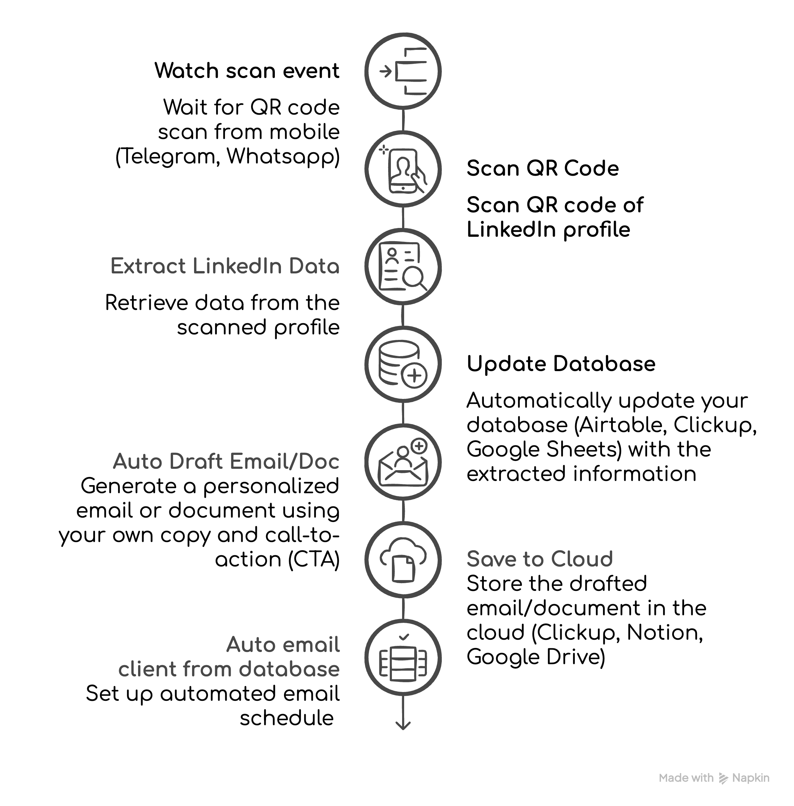

---
params:
  title: "LinkedIn profile scraper to mailing list database via QR code reader"       
  subtitle: "Telegram, Uniqode, LinkedIn, Notion, Google Docs"        
  author: "99fold"
  email: "matt@99foldai.com"
  social: "@99foldai"
  date: "April 2025"    
  primary: "#284e36"
  secondary: "#c3c3c3"
  header1: "Summary"
  header1b: "Who is this perfect for?"
  header1c: "What does it do for you?"  
  header1d: "How does it work?"  
  header2: "Pathway"
  header3: "Process"
  header4: "More benefits"
  header5: "Example"
  here: "r"
  imgdir: "img"
  app1: "telegram.png"
  app2: "li.png"
  app3: "notion.png"
  app4: "gsheet.png"
  app5: "gdrive.png"
  img1: "linkedin.png"
  img2: "telegram2.png"
  img3: "clickup.png"
  img4: ""
  img5: ""
  img6: ""
  github: ""      
output: 
  # pdf_document:
  html_document:
    theme: "cosmo"
    css: css/style.css
    includes:
      # reactivate once header img sizing is fixed  
      before_body: html/header.html
      after_body: html/footer.html
---

   

<!-- quicksand font -->

<!-- <link rel="stylesheet"href="//fonts.googleapis.com/css?family=Quicksand:300,400,600,700&amp;lang=en"/> -->

<!-- css for tabs -->


```{r, echo=F, eval=T, error=F, warning=F, results='asis'}

htmltools::HTML(readr::read_file(here::here("html", "calendly.html")))
```


```{=html}
<style type="text/css">

.nav>li>a{
    position: relative;
    display: block;
    padding: 10px 15px;
}

.nav-pills>li>a:hover{
  background: `r params$primary`;
  color: `r params$secondary`;
  opacity:0.7;
}

.nav-pills>li>a:focus, .nav-pills>li.active>a, .nav-pills>li.active>a:hover, .nav-pills>li.active>a:focus {
  background: `r params$primary`;
  background-color: `r params$primary`;
}

</style>
```


```{r, set-options, echo = F, cache = T, message=F}
options(width=25,tinytex.verbose = TRUE, width.cutoff=25)
knitr::opts_chunk$set(
 eval = F, # run all code
 echo = F, # show code chunks in output 
 tidy = T, # make output as tidy
 message = F,  # mask all messages
 warning = F, # mask all warnings 
 size="small", # set code chunk size,
 tidy.opts=list(width.cutoff=25) # set width of code chunks in output
)
# tinytex::install_tinytex()
# require(tinytex)
# install.packages("pacman")
# require(pacman)

# knitr::read_chunk(here::here("r","make_map.R"))
# source(here::here("r","make_gitignore.R"))
# source(here::here("r","make_plot_stacked.R"))
```

\  

# [`r params$title`]{style="font-size: 200%;"}
# [`r params$subtitle`]{style="font-size: 100%;"}

\      

<center> 
[`r params$author` | `r params$email` | `r params$social`]{style="font-size: 120%; color:`r params$secondary`;"} 

<!-- feather icons -->
<script src="https://unpkg.com/feather-icons"></script>

<p>
    
    <!-- calendly -->
    <a href="https://urldefense.com/v3/__https://www.linkedin.com/in/mmalishev/__;!!LBk0ZmAmG_H4m2o!oVrnGVTq4VaGa7cN1gDQyR-O-uL_Yd8JSrkae11vsa2I21g1vV9KxKx0txpwzaf2r62aEVKCC1cHORxRiSg$"> <!-- calendly -->
        <i data-feather="mail"></i> 
    </a>
    <!-- linkedin -->
    <a href="https://urldefense.com/v3/__https://www.linkedin.com/in/mmalishev/__;!!LBk0ZmAmG_H4m2o!oVrnGVTq4VaGa7cN1gDQyR-O-uL_Yd8JSrkae11vsa2I21g1vV9KxKx0txpwzaf2r62aEVKCC1cHORxRiSg$"> <!-- linkedin -->
        <i data-feather="linkedin"></i> 
    </a>
    <a href="">  <!-- instagram -->
        <i data-feather="instagram"></i> 
    </a>
</p>

<!-- feather icons -->
<script>
feather.replace()
</script>

&nbsp;


</center>

\  

---

\  

<!-- #### Refs   -->
<!-- Apify: https://console.apify.com/actors/oAuCIx3ItNrs2okjQ/runs/5I1jMq1JPXb79H4AU#output           -->
<!-- Napkin url: https://app.napkin.ai/page/CgoiCHByb2Qtb25lEiwKBFBhZ2UaJDRlMWI1MGIyLTk0MzAtNDVlMS1iYzMyLTFkYTY5ZGRhZDM5Mg?s=1   -->

<!-- ------------------------------------------------------------------------ -->

<!-- # `r params$header1` {.tabset .tabset-fade .tabset-pills} -->
<!-- tab1 -->
<!-- ## [Plots]{style="color:`r params$secondary`;"} # add custom css styling to tabs-->

# `r params$header1`

Extracting LinkedIn profile data using a QR code scanner (Telegram, Whatsapp), updating a mailing list database (Notion, Clickup, Airtable), auto draft a personalised email/doc with your own copy/CTA, and save to the cloud (Google Drive), then initiate an auto email campaign from the client database.   

The workflow is designed to streamline the process of collecting and managing client data by enhancing efficiency in outreach efforts using automated app integrations and auto scheduling.  


\  

---

\  


# `r params$header1b`  

#  {.tabset .tabset-fade }

## Service provider  \
## Sales teams \ 
## Recruitment agency \  
## Brick and mortar business \  
## Sport clubs \  
## Tourism agency \  
## Digital design business \  
## Brand strategist \ 


# `r params$header1d` 

1. Wait for QR code scan from mobile (Telegram, Whatsapp)  
2. Scan QR Code: Use your phone to scan the QR code from a person’s LinkedIn profile.   
3. Extract LinkedIn Data: Retrieve the relevant data from the scanned profile.  
4. Update Database: Automatically update your database (Airtable, Clickup, Google Sheets) with the extracted information.  
5. Auto Draft Email/Doc: Generate a personalized email or document using your own copy and call-to-action (CTA).  
6. Save to Cloud: Store the drafted email/document in the cloud (Clickup, Notion, Google Drive).  
7. Auto email client from database: Set up automated email schedule         


\  

---

\  

```{r, echo=F, eval=T, error=F, warning=F, results='asis'}  
htmltools::HTML(readr::read_file(here::here("html", "calendly_inline.html"))) 
```   

\

# `r params$header2`  

\  
Low-friction integration with your existing apps, workflow, and systems        
\  


<!-- ##### Side by side image -->

```{r, echo = FALSE, out.width = "15%", fig.align = "center", fig.show='hold', fig.align='center', out.extra = "style='display:inline-block; margin-right:5px;'"}
knitr::include_graphics(c(
  paste(params$imgdir,params$app1,sep = "/")
  ,paste(params$imgdir,params$app2,sep = "/")
  ,paste(params$imgdir,params$app3,sep = "/")
  ,paste(params$imgdir,params$app4,sep = "/")
  ,paste(params$imgdir,params$app5,sep = "/")
  ))
```

\  

---

\  

# `r params$header3`

<!-- left justified image -->
<div class = "row">
  <div class = "col-md-8"> <!-- img  -->
  <center>
   
</div>
  <div class = "col-md-4"> 
  <br>

> Instantly compile LinkedIn profile data via mobile QR scanner     

  </div>
</div>

\    

<!-- right justified image -->
<div class = "row">
  <div class = "col-md-4 right-just"> <!-- img  -->
  <br><br>     

> Process data in real time via mobile app (e.g Telegram). Ideal for networking events, meetups, sharing contact details in person.  

<br>     
</div>
  <div class = "col-md-8"> 
  <center> 
  </center>
  </div>
</div>

\  

<!-- left justified image -->
<div class = "row">
  <div class = "col-md-8"> <!-- img  -->
  <center> 
  </center>
</div>
  <div class = "col-md-4"> 
  <br>

> Send data and auto update your client/mailing/contact database (Clickup, Airtable, Google Sheets)        

  </div>
</div>

\  

---

\  

```{r, echo=F, eval=T, error=F, warning=F, results='asis'}  
htmltools::HTML(readr::read_file(here::here("html", "calendly_inline.html"))) 
```   

\    

# `r params$header4`

### Tasks  
- Auto collect LinkedIn profile data using QR codes      
- Generate automated and personalised outreach emails and profiles     
- Store, manage, and analyse contact information in a centralised cloud database     

### Benefits  
- Streamline outreach process to convert more leads into customers      
- Improve customer experience with hyper-personalised communication   
- Reduce manual data entry and overheads    


\  

---

\    


# `r params$header5`

Example of automated workflow (replace with your own tasks/apps)      

<center>
    
</center>


#


\  

```{r, echo=F, eval=T, error=F, warning=F, results='asis'}

htmltools::HTML(readr::read_file(here::here("html", "calendly_inline.html")))
```

\


