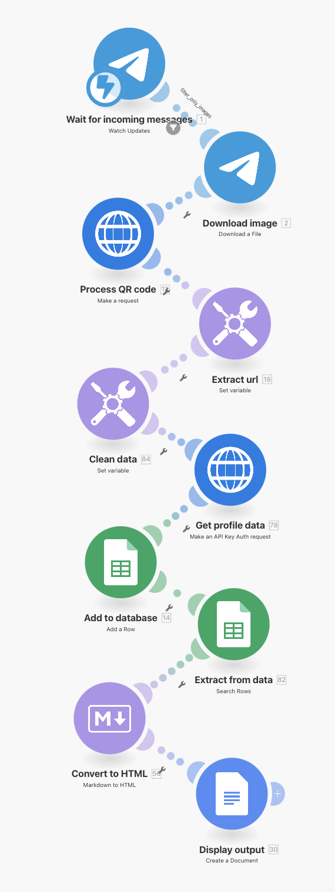

---
params:
  title: "LinkedIn profile scraper to mailing list database via QR code reader"       
  subtitle: "Telegram, Uniqode, LinkedIn, Google Sheets, Google Docs"        
  author: "99fold"
  email: "matt@99foldai.com"
  social: "@99foldai"
  date: "April 2025"    
  primary: "#284e36"
  secondary: "#c3c3c3"
  header1: "Summary"
  header2: "Integrations"
  header3: "Workflow"
  header4: "Example"
  here: "r"
  imgdir: "img"
  app1: #"telegram.png"
  app2: "linkedin.png"
  img1: "linkedin.png"
  img2: "telegram2.png"
  img3: "clickup.png"
  img4: ""
  img5: ""
  img6: ""
  github: ""      
output: 
  # pdf_document:
  html_document:
    theme: "cosmo"
    css: css/style.css
    includes:
      # reactivate once header img sizing is fixed  
      # before_body: html/header.html 
      after_body: html/footer.html
---

<!-- quicksand font -->

<!-- <link rel="stylesheet"href="//fonts.googleapis.com/css?family=Quicksand:300,400,600,700&amp;lang=en"/> -->

<!-- css for tabs -->

```{=html}
<style type="text/css">

.nav>li>a{
    position: relative;
    display: block;
    padding: 10px 15px;
}

.nav-pills>li>a:hover{
  background: `r params$primary`;
  color: `r params$secondary`;
  opacity:0.7;
}

.nav-pills>li>a:focus, .nav-pills>li.active>a, .nav-pills>li.active>a:hover, .nav-pills>li.active>a:focus {
  background: `r params$primary`;
  background-color: `r params$primary`;
}

</style>
```


```{r, set-options, echo = F, cache = T, message=F}
options(width=25,tinytex.verbose = TRUE, width.cutoff=25)
knitr::opts_chunk$set(
 eval = F, # run all code
 echo = F, # show code chunks in output 
 tidy = T, # make output as tidy
 message = F,  # mask all messages
 warning = F, # mask all warnings 
 size="small", # set code chunk size,
 tidy.opts=list(width.cutoff=25) # set width of code chunks in output
)
# tinytex::install_tinytex()
# require(tinytex)
# install.packages("pacman")
# require(pacman)

# knitr::read_chunk(here::here("r","make_map.R"))
# source(here::here("r","make_gitignore.R"))
# source(here::here("r","make_plot_stacked.R"))
```

\  
\  

# [`r params$title`]{style="font-size: 200%;"}
# [`r params$subtitle`]{style="font-size: 150%;"}

\  
\      

<center> 
[`r params$author` | `r params$email` | `r params$social`]{style="font-size: 120%; color:`r params$secondary`;"} 

<!-- feather icons -->
<script src="https://unpkg.com/feather-icons"></script>

<p>
    
    <!-- calendly -->
    <a href="https://urldefense.com/v3/__https://www.linkedin.com/in/mmalishev/__;!!LBk0ZmAmG_H4m2o!oVrnGVTq4VaGa7cN1gDQyR-O-uL_Yd8JSrkae11vsa2I21g1vV9KxKx0txpwzaf2r62aEVKCC1cHORxRiSg$"> <!-- calendly -->
        <i data-feather="mail"></i> 
    </a>
    <!-- linkedin -->
    <a href="https://urldefense.com/v3/__https://www.linkedin.com/in/mmalishev/__;!!LBk0ZmAmG_H4m2o!oVrnGVTq4VaGa7cN1gDQyR-O-uL_Yd8JSrkae11vsa2I21g1vV9KxKx0txpwzaf2r62aEVKCC1cHORxRiSg$"> <!-- linkedin -->
        <i data-feather="linkedin"></i> 
    </a>
    <a href="">  <!-- instagram -->
        <i data-feather="instagram"></i> 
    </a>
</p>

<!-- feather icons -->
<script>
feather.replace()
</script>

&nbsp;


</center>

\  

---

\  

<!-- #### Refs   -->
<!-- Apify: https://console.apify.com/actors/oAuCIx3ItNrs2okjQ/runs/5I1jMq1JPXb79H4AU#output           -->
<!-- Napkin url: https://app.napkin.ai/page/CgoiCHByb2Qtb25lEiwKBFBhZ2UaJDRlMWI1MGIyLTk0MzAtNDVlMS1iYzMyLTFkYTY5ZGRhZDM5Mg?s=1   -->

napkin script  

Get LinkedIn profile data by scanning the QR code from a person’s LinkedIn profile with your phone (Telegram bot) to update your database (Airtable, Clickup, Google Sheets), auto draft a personalised email/doc with your own copy/CTA, and save to the cloud (Clickup, Notion, Google Drive).

<!-- ------------------------------------------------------------------------ -->

<!-- # `r params$header1` {.tabset .tabset-fade .tabset-pills} -->
<!-- tab1 -->
<!-- ## [Plots]{style="color:`r params$secondary`;"} # add custom css styling to tabs-->

# `r params$header1`

Get LinkedIn profile data by scanning the QR code from a person's LinkedIn profile with your phone (Telegram bot) to update your database (Airtable, Clickup, Google Sheets), auto draft a personalised email/doc with your own copy/CTA, and save to the cloud (Clickup, Notion, Google Drive).      

1.     

\  

---

\  

# `r params$header2`  

\  
Low-friction integration with your existing apps, workflow, and systems      

<!-- ##### Side by side image -->

```{r, echo = FALSE, out.width = "20%", fig.align = "center", out.extra = "style = 'display: inline;'", fig.show='hold', fig.align='center'}
knitr::include_graphics(c(
  paste(params$imgdir,params$app1,sep = "/")
  # paste(params$imgdir,params$app1,sep = "/"),
  # paste(params$imgdir,params$app1,sep = "/"),
  # paste(params$imgdir,params$app1,sep = "/"),
  # paste(params$imgdir,params$app1,sep = "/")
  ))
```

\  

---

\  

# `r params$header3`

<!-- left justified image -->
<div class = "row">
  <div class = "col-md-8"> <!-- img  -->
  <center> 
  </center>
</div>
  <div class = "col-md-4"> 
  <br>

> Instantly compile LinkedIn profile data via mobile QR scanner     

  </div>
</div>

\    

<!-- right justified image -->
<div class = "row">
  <div class = "col-md-4 right-just"> <!-- img  -->
  <br><br>     

> Process data in real time via mobile app (e.g Telegram). Ideal for networking events, meetups, sharing contact details in person.  

<br>     
</div>
  <div class = "col-md-8"> 
  <center> 
  </center>
  </div>
</div>

\  

<!-- left justified image -->
<div class = "row">
  <div class = "col-md-8"> <!-- img  -->
  <center> 
  </center>
</div>
  <div class = "col-md-4"> 
  <br>

> Send data and auto update your client/mailing/contact database (Clickup, Airtable, Google Sheets)        

  </div>
</div>

\  

---

\    

# `r params$header4`

Example of automated workflow (replace with your own tasks/apps)      

<center>
    
</center>


#


