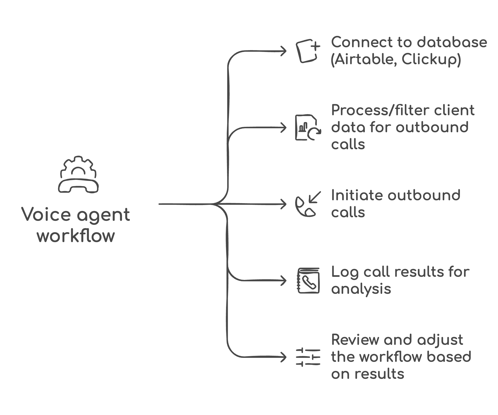
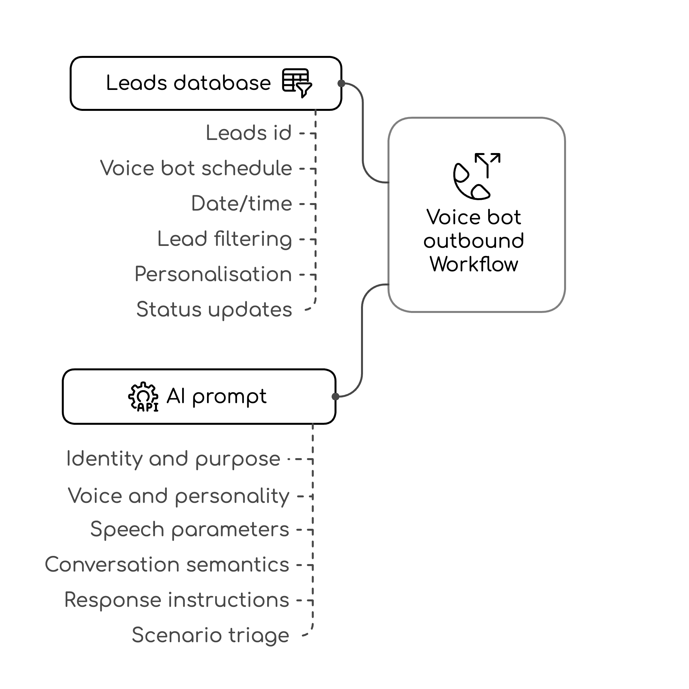

---
params:
  title: "Voice agent leads outreach"         
  subtitle: "Vapi, Open AI, Clickup, Airtable, Google Drive"      
  author: "99fold"
  email: "matt@99foldai.com"
  social: "@99foldai"
  date: "April 2025"    
  primary: "#284e36"
  secondary: "#c3c3c3"
  header1: "Summary"
  header2: "Integrations"
  header3: "Workflow"
  header4: "Outcomes"
  header5: "Example"
  here: "r"
  imgdir: "img"
  app1: "app1.png"
  app2: "app2.png"
  app3: "app3.png"
  app4: "app4.png"
  app5: "app5.png"
  img1: "img1.png"
  img2: "img2.png"
  img3: "img3.png"
  img4: ""
  img5: ""
  img6: ""
  github: ""      
output: 
  # pdf_document:
  html_document:
    theme: "cosmo"
    css: css/style.css
    includes:
      # reactivate once header img sizing is fixed  
      before_body: html/header.html
      after_body: html/footer.html
---

<!-- quicksand font -->

<!-- <link rel="stylesheet"href="//fonts.googleapis.com/css?family=Quicksand:300,400,600,700&amp;lang=en"/> -->

<!-- css for tabs -->


<!-- Calendly badge widget begin -->
<link href="https://assets.calendly.com/assets/external/widget.css" rel="stylesheet">
<script src="https://assets.calendly.com/assets/external/widget.js" type="text/javascript" async></script>
<script type="text/javascript">window.onload = function() { Calendly.initBadgeWidget({ url: 'https://calendly.com/99foldai/intro-chat?primary_color=284e36', text: 'Like this automation? Jump on a call to see more.', color: '#284e36', textColor: '#ffffff' }); }</script>
<!-- Calendly badge widget end -->


```{=html}
<style type="text/css">

.nav>li>a{
    position: relative;
    display: block;
    padding: 10px 15px;
}

.nav-pills>li>a:hover{
  background: `r params$primary`;
  color: `r params$secondary`;
  opacity:0.7;
}

.nav-pills>li>a:focus, .nav-pills>li.active>a, .nav-pills>li.active>a:hover, .nav-pills>li.active>a:focus {
  background: `r params$primary`;
  background-color: `r params$primary`;
}

</style>
```


```{r, set-options, echo = F, cache = T, message=F}
options(width=25,tinytex.verbose = TRUE, width.cutoff=25)
knitr::opts_chunk$set(
 eval = F, # run all code
 echo = F, # show code chunks in output 
 tidy = T, # make output as tidy
 message = F,  # mask all messages
 warning = F, # mask all warnings 
 size="small", # set code chunk size,
 tidy.opts=list(width.cutoff=25) # set width of code chunks in output
)
# tinytex::install_tinytex()
# require(tinytex)
# install.packages("pacman")
# require(pacman)

# knitr::read_chunk(here::here("r","make_map.R"))
# source(here::here("r","make_gitignore.R"))
# source(here::here("r","make_plot_stacked.R"))
```

\  
\  

# [`r params$title`]{style="font-size: 200%;"}
# [`r params$subtitle`]{style="font-size: 150%;"}

\  
\      

<center> 
[`r params$author` | `r params$email` | `r params$social`]{style="font-size: 120%; color:`r params$secondary`;"} 

<!-- feather icons -->
<script src="https://unpkg.com/feather-icons"></script>

<p>
    
    <!-- calendly -->
    <a href="https://urldefense.com/v3/__https://www.linkedin.com/in/mmalishev/__;!!LBk0ZmAmG_H4m2o!oVrnGVTq4VaGa7cN1gDQyR-O-uL_Yd8JSrkae11vsa2I21g1vV9KxKx0txpwzaf2r62aEVKCC1cHORxRiSg$"> <!-- calendly -->
        <i data-feather="mail"></i> 
    </a>
    <!-- linkedin -->
    <a href="https://urldefense.com/v3/__https://www.linkedin.com/in/mmalishev/__;!!LBk0ZmAmG_H4m2o!oVrnGVTq4VaGa7cN1gDQyR-O-uL_Yd8JSrkae11vsa2I21g1vV9KxKx0txpwzaf2r62aEVKCC1cHORxRiSg$"> <!-- linkedin -->
        <i data-feather="linkedin"></i> 
    </a>
    <a href="">  <!-- instagram -->
        <i data-feather="instagram"></i> 
    </a>
</p>

<!-- feather icons -->
<script>
feather.replace()
</script>

&nbsp;


</center>

\  

---

\  

<!-- #### Refs   -->
<!-- Apify: https://console.apify.com/actors/oAuCIx3ItNrs2okjQ/runs/5I1jMq1JPXb79H4AU#output           -->
<!-- Napkin url: https://app.napkin.ai/page/CgoiCHByb2Qtb25lEiwKBFBhZ2UaJDRlMWI1MGIyLTk0MzAtNDVlMS1iYzMyLTFkYTY5ZGRhZDM5Mg?s=1   -->


<!-- ------------------------------------------------------------------------ -->

<!-- # `r params$header1` {.tabset .tabset-fade .tabset-pills} -->
<!-- tab1 -->
<!-- ## [Plots]{style="color:`r params$secondary`;"} # add custom css styling to tabs-->

# `r params$header1`

This workflow outlines an automated outbound calling process using a voice AI agent, integrated with client database systems like Airtable or ClickUp. Voice agent is triggered to make calls, following a personalised prompt (Open AI). Outcomes are logged back into the database for tracking and review. The voice agent operates with a clearly defined prompt --- introduction, confirms business details, asks relevant questions, suggests next steps --- and is trained to handle objections, offer helpful previews of templates or products with no sales pressure. The review phase includes assessing results and refining the process as needed.      
\  


1. Connect to client database (Airtable, Clickup)    
Connect to your custom client database app 

2. Process retrieved data  
Analyse and prepare the retrieved data for the outbound phone call process  

3. Initiate voice agent workflow (outbound calls) with Open AI personalisation        
Trigger voice agent action and prompts (see below schematic)      

4. Log call results    
Record the outcomes of each call in database (Clickup, Auirtable)   

5. Review/adjust summary    
Assess the results and make necessary adjustments to the workflow as needed    

\  


**Voice agent Open AI instructions**        

1. Identity and purpose      
Introduction and general scope and purpose of call    

2. Voice and personality    
Friendly, relaxed, and curious with a natural, human, conversational tone   

3. Speech parameters      
Begin casually, explain the aims of your business, and ask for basic info  

4. Conversation semantics    
Ask one question at a time, confirm details, and close with warmth and respect  

5. Response instructions  
Adapt to questions or objections with honesty and appreciation, no pressure  

6. Scenario triage  
Show pre-built templates/products, no cost or sales, only a helpful preview    


---

\  

# `r params$header2`  

\  
Low-friction integration with your existing apps, workflow, and systems      

<!-- ##### Side by side image -->  

```{r, echo = FALSE, out.width = "15%", fig.align = "center", fig.show='hold', fig.align='center', out.extra = "style='display:inline-block; margin-right:5px;'"}
knitr::include_graphics(c(
  paste(params$imgdir,params$app1,sep = "/")
  ,paste(params$imgdir,params$app2,sep = "/")
  ,paste(params$imgdir,params$app3,sep = "/")
  ,paste(params$imgdir,params$app4,sep = "/")
  ,paste(params$imgdir,params$app5,sep = "/")
  ))
```

\    

---

\  

# `r params$header3`
\  

<!-- left justified image -->
<div class = "row">
  <div class = "col-md-8"> <!-- img  -->
  <center> 
  </center>
</div>
  <div class = "col-md-4"> 
  <br>

> Connect your existing client database, such as Clickup, Airtable, Google Sheets   

  </div>
</div>

\    

<!-- right justified image -->
<div class = "row">
  <div class = "col-md-4 right-just"> <!-- img  -->
  <br><br>     

> Personalised voice agent to handle outreach and support/FAQs      

<br>     
</div>
  <div class = "col-md-8"> 
  <center> 
  </center>
  </div>
</div>

\  

<!-- left justified image -->
<div class = "row">
  <div class = "col-md-8"> <!-- img  -->
  <center> 
  </center>
</div>
  <div class = "col-md-4"> 
  <br>  

> Call data analysis for further refinements and improved workflow        

  </div>
</div>

\  

---

\    

# `r params$header4`

### Tasks      

- Automatically connect to your current client database with no need for separate apps    
- Trigger outbound calls via a trained voice AI agent using personalized, objection-handling scripts    
- Log call outcomes directly into your system for real-time tracking and follow-up actions  

### Benefits          

- Boost lead engagement and conversions by reaching more prospects with no added team bandwidth  
- Streamline outbound processes with consistent, human-like AI calls 
- Gain data-driven insights to refine messaging, improve targeting, and optimize outreach strategies      


\  

---

\    


# `r params$header5`

Example of automated workflow (replace with your own tasks/apps)        


<center>
    
</center>


\  

<center>
    
</center>


#


