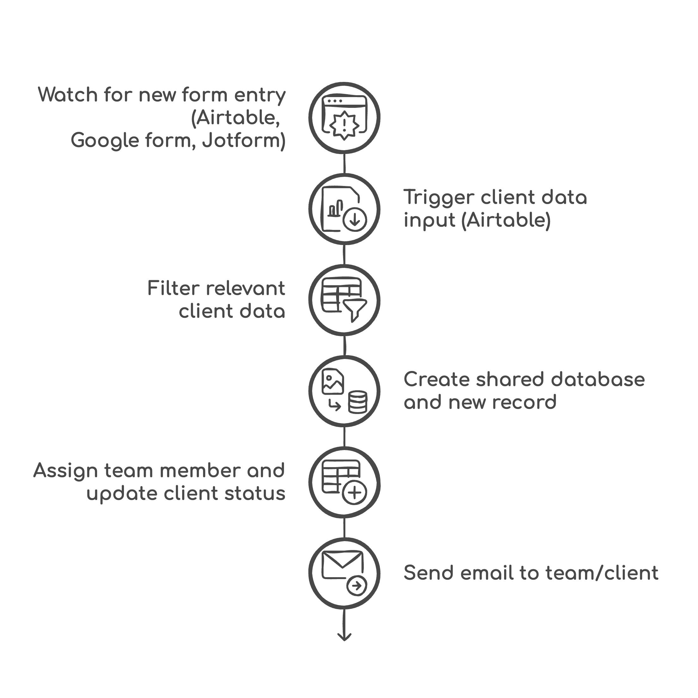
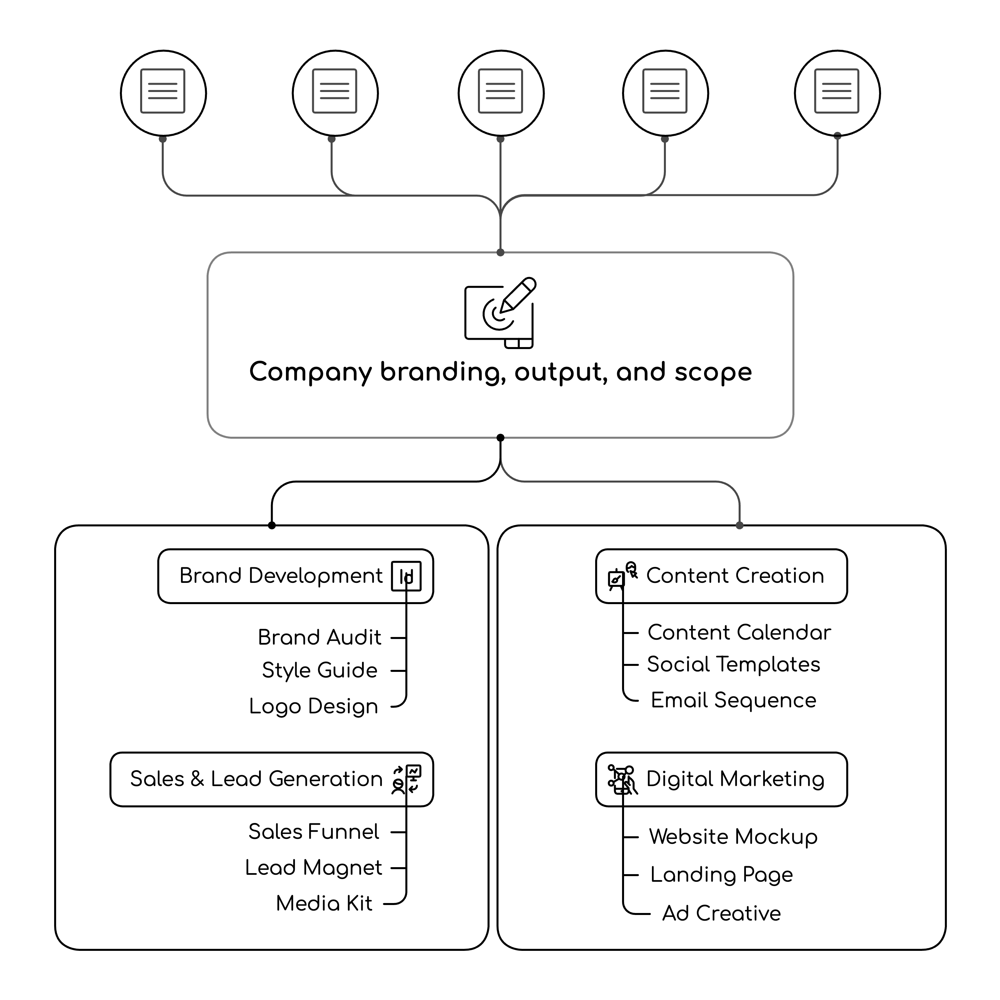

---
params:
  title: "Agency welcome pack"     
  subtitle: "Gmail, Google Drive, Airtable"      
  author: "99fold"
  email: "matt@99foldai.com"
  social: "@99foldai"
  date: "April 2025"    
  primary: "#284e36"
  secondary: "#c3c3c3"
  header1: "Summary"
  header1b: "Who is this perfect for?"
  header1c: "What does it do for you?"  
  header1d: "How does it work?"  
  header2: "Pathway"
  header3: "Process"
  header4: "More benefits"
  header5: "Example"
  here: "r"
  imgdir: "img"
  app1: "app1.png"
  app2: "app2.png"
  app3: "app3.png"
  img1: "img1.png"
  img2: "img2.png"
  img3: "img3.png"
  img4: ""
  img5: ""
  img6: ""
  roihours: 12
  roivalue: 1500
  roirate: 10
  github: ""      
output: 
  # pdf_document:
  html_document:
    self_contained: false
    theme: "cosmo"
    css: css/style.css
    includes:
      # reactivate once header img sizing is fixed  
      before_body: html/header.html
      after_body: html/footer.html
---

<!-- quicksand font -->

<!-- <link rel="stylesheet"href="//fonts.googleapis.com/css?family=Quicksand:300,400,600,700&amp;lang=en"/> -->

<!-- css for tabs -->


```{r, echo=F, eval=T, error=F, warning=F, results='asis'}

htmltools::HTML(readr::read_file(here::here("html", "calendly.html")))
```


```{=html}
<style type="text/css">

.nav>li>a{
    position: relative;
    display: block;
    padding: 10px 15px;
}

.nav-pills>li>a:hover{
  border-radius: 15px;
  background: `r params$primary`;
  color: `r params$secondary`;
  opacity:0.7;
}

.nav-pills>li>a:focus, .nav-pills>li.active>a, .nav-pills>li.active>a:hover, .nav-pills>li.active>a:focus {
  border-radius: 15px;
  background: `r params$primary`;
  background-color: `r params$primary`;
}


</style>
```


```{r, set-options, echo = F, cache = T, message=F}
options(width=25,tinytex.verbose = TRUE, width.cutoff=25)
knitr::opts_chunk$set(
 eval = F, # run all code
 echo = F, # show code chunks in output 
 tidy = T, # make output as tidy
 message = F,  # mask all messages
 warning = F, # mask all warnings 
 size="small", # set code chunk size,
 tidy.opts=list(width.cutoff=25) # set width of code chunks in output
)
# tinytex::install_tinytex()
# require(tinytex)
# install.packages("pacman")
# require(pacman)

# knitr::read_chunk(here::here("r","make_map.R"))
# source(here::here("r","make_gitignore.R"))
# source(here::here("r","make_plot_stacked.R"))
```

\  
\  

# [`r params$title`]{style="font-size: 200%;"}
# [`r params$subtitle`]{style="font-size: 150%;"}

\  
\      


<center> 
[`r params$author` | `r params$email` | `r params$social`]{style="font-size: 120%; color:`r params$secondary`;"} 

<!-- feather icons -->
<script src="https://unpkg.com/feather-icons"></script>

<p>
    
    <!-- email -->
    <a href="https://urldefense.com/v3/__https://www.linkedin.com/in/mmalishev/__;!!LBk0ZmAmG_H4m2o!oVrnGVTq4VaGa7cN1gDQyR-O-uL_Yd8JSrkae11vsa2I21g1vV9KxKx0txpwzaf2r62aEVKCC1cHORxRiSg$"> <!-- calendly -->
        <i data-feather="mail"></i> 
    </a>
    <!-- linkedin -->
    <a href="https://urldefense.com/v3/__https://www.linkedin.com/in/mmalishev/__;!!LBk0ZmAmG_H4m2o!oVrnGVTq4VaGa7cN1gDQyR-O-uL_Yd8JSrkae11vsa2I21g1vV9KxKx0txpwzaf2r62aEVKCC1cHORxRiSg$"> <!-- linkedin -->
        <i data-feather="linkedin"></i> 
    </a>
    <a href="">  <!-- instagram -->
        <i data-feather="instagram"></i> 
    </a>
</p>

<!-- feather icons -->
<script>
feather.replace()
</script>

&nbsp;


</center>

\  

---

\  

<!-- #### Refs   -->
<!-- Apify: https://console.apify.com/actors/oAuCIx3ItNrs2okjQ/runs/5I1jMq1JPXb79H4AU#output           -->
<!-- Napkin url: https://app.napkin.ai/page/CgoiCHByb2Qtb25lEiwKBFBhZ2UaJDRlMWI1MGIyLTk0MzAtNDVlMS1iYzMyLTFkYTY5ZGRhZDM5Mg?s=1   -->


<!-- ------------------------------------------------------------------------ -->

<!-- # `r params$header1` {.tabset .tabset-fade .tabset-pills} -->
<!-- tab1 -->
<!-- ## [Plots]{style="color:`r params$secondary`;"} # add custom css styling to tabs-->

# `r params$header1`

Stuck repeating the same onboarding tasks for new leads and clients? Manually entering data, sending emails, and managing leads status? This automation workflow handles new client onboarding from monitoring expression of interest entries and lead qualifying/sanitising to updating your client database and scheduling reminders to clients and your team.   
\ 

Following the client onboarding, you can then add your own agency sales, promo, and branding products to the workflow via email or your regular marketing channels. This handles the entire client pipeline with your own branding content/material and integrate into your current system without any overhaul.    


# `r params$header1b`  

#  {.tabset .tabset-fade }

## Marketing agency \ 
## Creative agency \ 
## Digital design business \  
## Service provider  \
## Brand strategist \ 
## Logo designer \  
## Web designer \  
## UI/UX designer \  
## Creative/art director \  
## Design studio \  

# `r params$header1c`


```{r, echo=F, eval=T, error=F, warning=F,results=F}
source(here::here("r","roi.R"))
```

```{=html}
<div class="widget-container"><div class="section-heading">Time and tasks</div><div class="flex-row"><div class="data-box"><div class="data-label">Task hours (p/w)</div><div class="data-value"> `r task_hours_pw` </div></div><div class="data-box"><div class="data-label">Average client value ($)</div><div class="data-value">`r paste0("$",client_value)`</div></div><div class="data-box"><div class="data-label">Average close rate (%)</div><div class="data-value">`r params$roirate`</div></div></div><div class="section-heading">Outcomes</div><div class="flex-row"><div class="data-box"><div class="data-label">Hours saved (p/m)</div><div class="data-value">`r hours_saved_pm `</div></div><div class="data-box"><div class="data-label">Annual topline ROI ($)</div><div class="data-value">`r annual_roi`</div></div></div></div>
```


# `r params$header1d`  

  
  
1. Watch for new form entry        
Monitor form status for incoming responses    

2. Download client data    
Retrieve attached documents or files from the client's email.    

3. Filter relevant data  
Apply conditions to isolate only the necessary or actionable data.  

4. Upload filtered data to database (Airtable)   
Send cleaned and structured data to the appropriate database.  

5. Create shared database and new record  
Initialize a shared workspace and log a new entry with client data.  

6. Send email to team/client  
Email final results, updates, or next steps to relevant team and welcome pack to client.

\  


## 1.  Welcome form (example)      
Try out the live example form below by submitting your responses. Once the form is submitted, you can see the live updates on your database and the auto-scheduled sales funnel. If the below form doesn't display, find the form **[here](https://airtable.com/appVzBxhWOi2O4EiL/pagrqEIWjaSuLHk9n/form)**.    

<!-- Airtable embed starts -->
<iframe class="airtable-embed" src="https://airtable.com/embed/appVzBxhWOi2O4EiL/pagrqEIWjaSuLHk9n/form" frameborder="0" onmousewheel="" width="100%" height="533" style="background: transparent; border: 1px solid #ccc;"></iframe>
<!-- Airtable embed ends -->

\  

## 2. Welcome pack add-ons with your own agency branding      
Following onboarding, your own branded agency marketing campaign and/or welcome material can be added to the workflow to customise the onboarding experience, complete with agency design, palette, logos, and design scope. Check out the below examples for inspiration.      
\  

<!-- ------------------------------------------------------------------------ -->

#  {.tabset .tabset-fade .tabset-pills}

<!-- tab1 -->

<!-- ## [Plots]{style="color:`r params$secondary`;"} # add custom css styling to tabs-->


## Discovery call  \
## Brand audit  \
## Style guide  \
## Logo design  \
## Website mockup  \
## Pitch deck  \
## Landing page  \
## Ad creative  \
## Content calendar  \
## Social templates  \
## Email sequence  \
## SEO checklist  \
## Sales funnel  \
## Lead magnet  \
## Media kit  \
## Brand strategy  \
## Customer persona  \
## Copywriting guide  \
## Analytics report  \
## Mailing list \  
## Project proposal \  

# 


---

\  

# `r params$header2`  

\  
Low-friction integration with your existing apps, workflow, and systems      

<!-- ##### Side by side image -->  

```{r, echo = FALSE, out.width = "15%", fig.align = "center", fig.show='hold', fig.align='center', out.extra = "style='display:inline-block; margin-right:5px;'"}
knitr::include_graphics(c(
  paste(params$imgdir,params$app1,sep = "/")
  ,paste(params$imgdir,params$app2,sep = "/")
  ,paste(params$imgdir,params$app3,sep = "/")
  ))
```

\    

---

\  

# `r params$header3`
\  

<!-- left justified image -->
<div class = "row">
  <div class = "col-md-8"> <!-- img  -->
  <center> 
  </center>
</div>
  <div class = "col-md-4"> 
  <br>

> Wait for incoming form responses from new clients   

  </div>
</div>

\    

<!-- right justified image -->
<div class = "row">
  <div class = "col-md-4 right-just"> <!-- img  -->
  <br><br>     

> Trigger automated data entry to database (Airtable, Google Drive, Clickup)  

<br>     
</div>
  <div class = "col-md-8"> 
  <center> 
  </center>
  </div>
</div>

\  

<!-- left justified image -->
<div class = "row">
  <div class = "col-md-8"> <!-- img  -->
  <center> 
  </center>
</div>
  <div class = "col-md-4"> 
  <br>  

> Shoot off welcome email to new client with personalised message and branded content from your agency      

  </div>
</div>

\  

---

\    

# `r params$header4`

### Tasks
- Monitor and capture incoming client form submissions.  
- Filter and organize client data for easy access and analysis.  
- Communicate updates and necessary information to team members and clients.  

### Benefits
- Streamlined data management allows for quicker response times, leading to more sales opportunities.  
- Efficient communication and organized data ensure clients receive timely updates and support.
- Automated data handling reduces manual errors and saves time  

\  

---

\    


# `r params$header5`

Example of automated workflow (replace with your own tasks/apps)        


<center>
    
</center>

\  

#### Welcome pack add-ons with your own agency branding  

<center>
    
</center>


#


